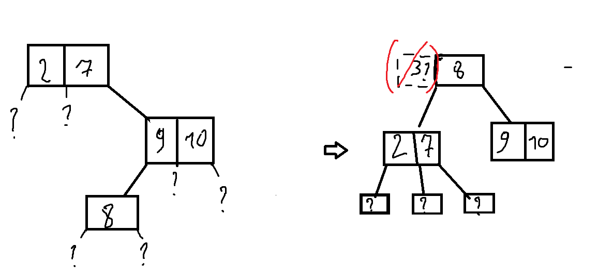
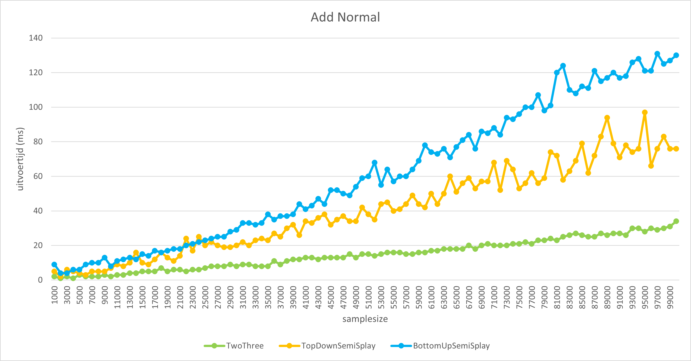
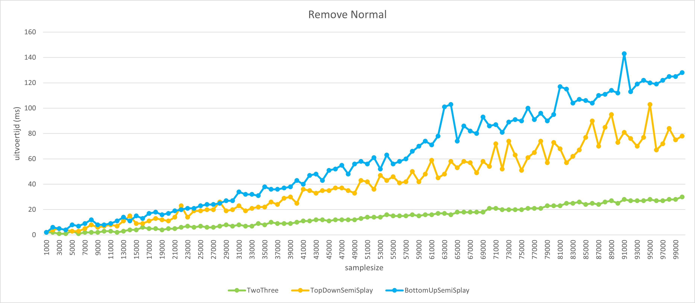
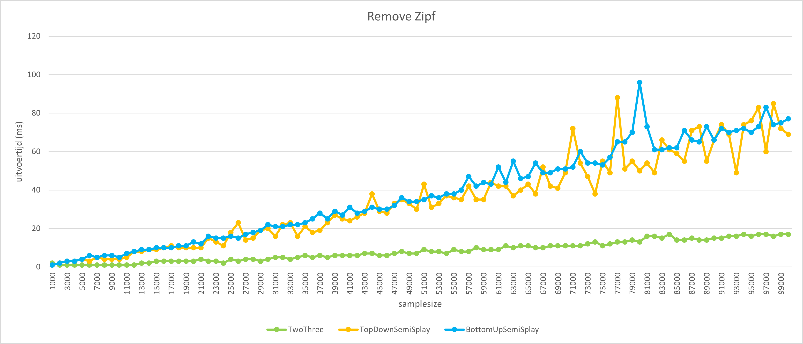
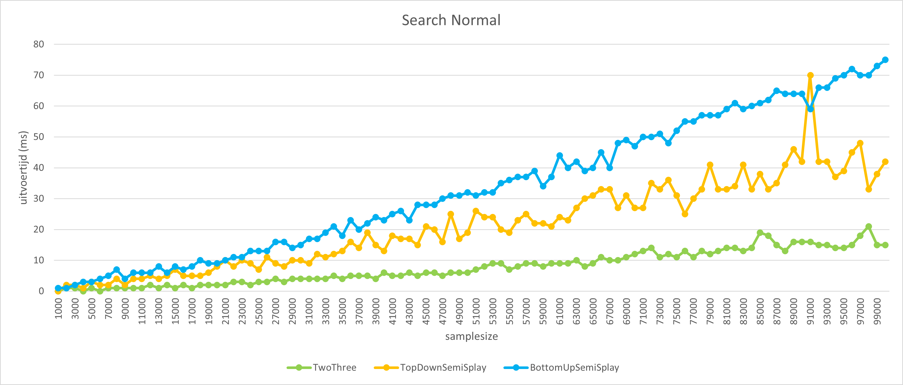
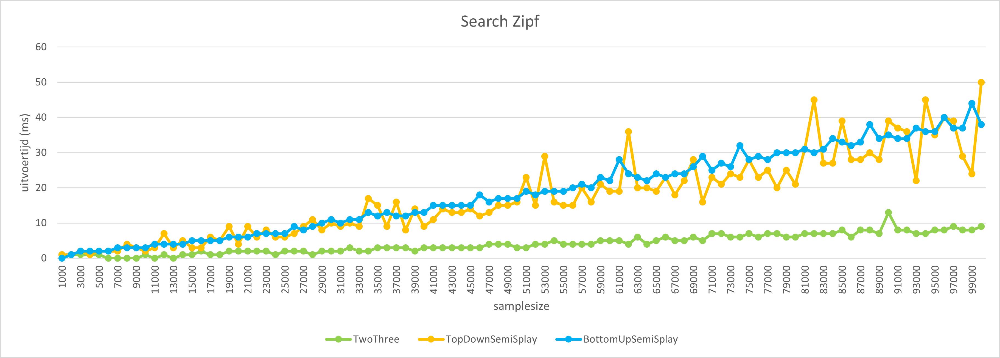

# 
 Verslag Algdata 2 project 2022

## 
 2-3 zoekbomen

#### 
Ben De Meurichy

### 1. Theoretische vragen
#### vraag 1
Wij gebruiken dus de potentiaalmethode. Voor een lege boom de-  
fini ̈eren wij $Φ(T ) = 0$. Stel nu dat T niet leeg is. Voor een top v in  
een semi-splay boom T defini ̈eren wij AT (v) (A() voor aantal) als het  
aantal sleutels in de deelboom bestaande uit v en al zijn nakomelingen  
in T . Bovendien zij LT (v) = log AT (v) (met L() voor logaritme). De  
potentiaal van de hele semi-splay boom T defini ̈eren wij nu als  $Φ(T ) = \sum_{v∈T}LT (v)$ 
De potentiaal wordt gewijzigd als een top toegevoegd wordt (nog zonder  
de boom te herbalanceren), verwijderd wordt (zonder herbalanceren)  
of als tijdens het herbalanceren deelbomen vervangen worden. Wij  
zullen deze 3 delen onafhankelijk van elkaar onderzoeken. Eerst het  
gemakkelijkste:  

**Deelresultaat 1**:Als uit een blad of uit een top met 1 sleutel en 1 kind of een top met 2 sleutels en 2 kinderen een sleutel uit een  boom T wordt verwijderd en het resultaat is de boom T ′ dan geldt $Φ(T ′) ≤ Φ(T )$.  
Hierbij bedoelen wij alleen maar het verwijderen van de top – zonder de splaybewerkingen die achteraf ook nog moeten gebeuren! Maar dan is het duidelijk omdat de aantallen van toppen in de deelbomen alleen maar kleiner kunnen worden.

**Deelresultaat 2**: Als een nieuwe sleutel tot de boom T wordt toegevoegd en het resultaat is de boom T ′ dan geldt $Φ(T ′) − Φ(T ) ≤ log(|T ′|)$.  
Ook hier hebben wij het alleen over het toevoegen zelf – zonder de  splaybewerkingen die achteraf ook nog moeten gebeuren!

Als T leeg was, klopt het duidelijk, dus stel dat T niet leeg was.  
Stel dat de toppen op het pad van de wortel naar de top met de nieuwe sleutel  
v1, . . . , vk zijn, waarbij vk de top met de nieuwe sleutel is. Natuurlijk zijn alleen maar  
de bijdragen van de toppen op dit pad gewijzigd – voor alle andere toppen is het aantal sleutels gelijk gebleven. Dan geldt  
$Φ(T′) = Φ(T ) − ∑^{k−1}_{i=1} LT (vi) + ∑^{k}_{i=1}LT′(vi)$
$= Φ(T ) + LT ′ (v1) + ∑^{k−1}_{i=1}(LT ′ (vi+1) − LT (vi))$
Maar voor $i ≥ 1$ geldt $AT (vi) ≥ AT (vi+1) + 1 = AT ′ (vi+1)$. Dat geeft  
$LT (vi) ≥ LT ′ (vi+1)$ en dus $LT ′ (vi+1) − LT (vi) ≤ 0$ en ten slotte  
$Φ(T ′) ≤ Φ(T ) + LT ′ (v1) = Φ(T ) + log(|T ′|)$
omdat de wortel natuurlijk precies $|T ′|$ opvolgers (de wortel zelf mee-geteld) heeft.

**Deelresultaat 3:** 
(geen tijd meer, sorry)
#### vraag 2
Het maximaal aantal toppen met 1 sleutel in een splaypad van k toppen is gelijk aan $\lceil$$k/2$$\rceil$ $-1$
__*bewijs:*__
Aangezien we na elke splay-bewerking maximaal 1 top met een enkele sleutel kunnen bekomen (de gevallen met 3 sleutels en 5 sleutels in de vervangboom) volgens de gegeven definitie.
Het aantal toppen met 1 sleutel zal dus overeenkomen met het aantal splay-bewerkingen .

Het aantal splaybewerkingen komt overeen met het aantal bogen na het doorlopen van het splaypad (dit is gemakkelijk na te rekenen). 
Omdat het aantal bogen gelijk is aan k-1 en het aantal bogen na het doorlopen van het splaypad gelijk is aan $\lceil$$\#bogen/2$$\rceil$ (lesnotas p16) zal het aantal toppen met 1 sleutel gelijk zijn aan 
$\lceil$$(k-1)/2$$\rceil$ =$\lceil$$(k/2)-(1/2)$$\rceil$=$\lceil$$(k/2)$$\rceil$-$\lceil$$(1/2)$$\rceil$ = $\lceil$$k/2$$\rceil$ $-1$ $\blacksquare$

### 2.  Implementaties

#### gewone 2-3 boom

Voor de gewone 2-3 zoekboom heb ik er voor gekozen om over alle mogelijke opties per grootte van de subtree, hierdoor is de code nogal omslachtig en groot maar presteert de boom wel zeer goed.
Ik heb er ook speciaal op gelet dat er zo weinig mogelijk nieuwe objecten worden aangemaakt.
Er is gewerkt met subtrees die recursief naar boven tot in de root balanceren.

*De vervangbomen die ik heb gebruikt bij probleembomen van :*
grootte 6:![[Pasted image 20221202213000.png]]
grootte 5:
![[Pasted image 20221202213331.png]] 

grootte 4:
![[Pasted image 20221202214213.png]]
grootte 3:
![[Pasted image 20221202213916.png]]
grootte 2:
![[Pasted image 20221202213928.png]]
*[vervangboom verplaatst het probleem naar boven in de boom waar het recursief wordt afgehandeld]*

#### Bottom Up Semi Splay 2-3 boom
De bottomup semi splay boom is geïmplementeerd aan de hand van een stack om de nodes bij te houden die gesplayed moeten worden.

Doordat toppen met 1 sleutel soms omhoog bewegen door de splay bewerking kan het soms niet mogelijk zijn om een sleutel toe te voegen in een enkele top, omdat deze niet noodzakelijk op deze plaats in de boom thuis hoort (zie voorbeeld).

*[het toevoegen van sleutel 3 aan de enkele top lijkt makkelijk door gewoon de kindtop 2,7 uit elkaar te trekken en deze te verplaatsen maar we weten niet wat de kinderen van deze top zijn waardoor we kinderen gaan moeten verplaatsen tot aan het uiteinde van de boom in het slechtste geval. Dit is onbegonnen werk en maakt de boom enorm inefficiënt.]*

Hierdoor zal de boom minder toppen met 2 sleutels bevatten en dus redelijk wat dieper zijn in het algemeen.
Dit is denk ik de reden van het duidelijke verschil in prestatie tussen de semi splay bomen en de gewone 2-3 boom.

De weinige dubbele nodes hadden waarschijnlijk voorkomen kunnen worden door het splayen op sleutels en niet op toppen (zoals nu). Dit had ik eerst geprobeerd om te implementeren maar dit vergrootte de complexiteit van de boom enorm.
De basis hiervan is vrij simpel door gewoon de sleutels van de toppen op het splaypad te sorteren en deze op de juiste plaats te steken maar de kinderen van de vervangbomen zitten dan niet altijd op de juiste plaats na een splay bewerking.

De gemakkelijkste oplossing hiervoor zou het herbalanceren van de kinderen zijn tot aan de bladeren van de boom wat natuurlijk onbegonnen werk is en de boom onbruikbaar maakt. 
Hierdoor zou de diepte van de boom in het algemeen minder groot zijn maar dan zou er wel gesorteerd worden wat per splay stap nog een extra $\Theta (nlog(n))$ toevoegd.
Hoewel dit maar voor maximaal 6 sleutels zou zijn als er zoals nu voor elke splay bewerking 3 toppen werden gekozen wat dus een kost van $\Theta(k*6log(6))$ zou toevoegen aan alle splaybewerkingen samen per opzoeking met k splaybewerkingen. 

Voor de 1000-10000 elementen waarvoor dit was gelukt was deze implementatie toch gemiddeld een kwart sneller dan de huidige.

### Top Down Semi Splay 2-3 boom

Deze boom is ongeveer hetzelfde geïmlementeerd als de bottom up boom buiten dan dat de boom al tijdens het zoeken splay bewerkingen uitvoert.
Eerst was de *splay* functie recursief gedefinïeerd tot aan de wortel wat voor de bottom up boom geen probleem was maar voor deze boom wel.

Hierdoor zou de boom bij elke opgeroepen splaybewerking tot aan de wortel splayen waardoor deze een pak trager was dan de andere.
Om dit op te lossen heb ik een stack gebruikt met alle nodige toppen die door *splay()* wordt afgehandeld met een while loop. 
Tijdens het zoeken worden er toppen toegevoegd aan de stack en als deze 3 toppen groot is wordt er gesplayed.

De vervangbomen die ik heb gebruikt zijn voor beide semi-splay bomen dezelfde:
Alle vervangbomen zijn een variatie op deze bomen met variërende topgroottes met de nodige logische aanpassingen (geen kind3 bij ouder grootte 1 ,...) en c een mogelijk origineel kind van een van de 3 gesplayde toppen.
![[Pasted image 20221202223623.png]]

### 3. Benchmarks en performantie
**Toevoegen**
---

**Verwijderen**
---

**Opzoeken**
---

 

**Conclusie**
Aan de grafieken is duidelijk af te lezen dat over het algemeen de gewone 2-3 boom beter prestreert, dit ligt waarschijnlijk aan het eerder besproken probleem met de diepte van de splay bomen.
De top down implementatie van de semi splay boom presteert iets beter dan de bottom up versie van de semi splay 2-3 boom. 
Dit verschil is over alle operaties iets groter bij de normaalverdeling dan bij de zipf verdeling.
De uitvoertijd bij de zipf verdeling is wel redelijk wat minder dan bij de normaalverdeling bij alle operaties, het duidelijkst zichtbaar bij het opzoeken.

Het is logsich dat de top down boom iets beter is dan de bottom up omdat deze minder keer over het splaypad gaat tijdens het uitvoeren van de splaybewerkingen.